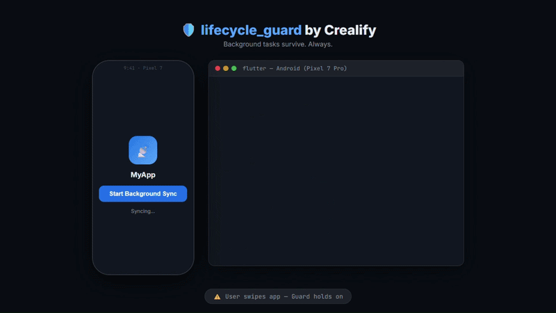
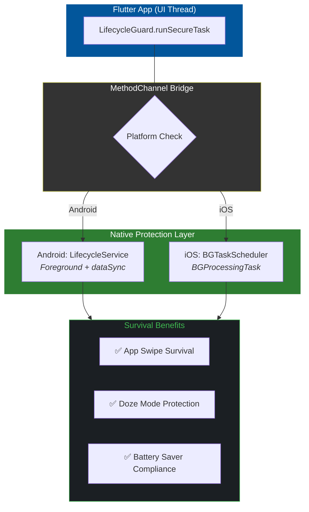

<div align="center">

# 🛡️ lifecycle_guard

**The bulletproof Flutter plugin for mission-critical background execution.**

Stop losing data when Android or iOS aggressively kills your app.
`lifecycle_guard` ensures your background tasks survive termination, system reboots, and battery optimizations — guaranteed.

[](https://pub.dev/packages/lifecycle_guard)
[](LICENSE)
[](https://flutter.dev)
[](#platform-support)
[](CONTRIBUTING.md)

</div>

---

## 🎬 Demo

<div align="center">
  
  <p><i>Watch lifecycle_guard in action: App swipe → Background survival → Task completion.</i></p>
</div>

---

## ✨ Features

| Feature | Description |
|---|---|
| 🛡️ **Isolate Protection** | Boots a lightweight secondary engine so your task never shares the UI thread fate |
| 🤖 **Android 15+ Ready** | Fully compliant with new `foregroundServiceType: dataSync` requirements |
| 🍎 **iOS Compatible** | Bridges to Apple's native background task scheduler |
| 📡 **Zero Data Loss** | Tasks continue even when users swipe the app away |
| ⚡ **30-Second Setup** | One-line API — no complex native configuration needed |
| 🔐 **User-Safe** | No auto-execution, no hidden scripts, everything is user-triggered |

---

## 🚀 Quick Start

### Installation

Add to your `pubspec.yaml`:

```yaml
dependencies:
  lifecycle_guard: ^0.0.1
```

Then run:

```sh
flutter pub get
```

### Android Setup

Add the required permission and service declaration to your `android/app/src/main/AndroidManifest.xml`:

```xml
<uses-permission android:name="android.permission.FOREGROUND_SERVICE" />
<uses-permission android:name="android.permission.FOREGROUND_SERVICE_DATA_SYNC" />
<uses-permission android:name="android.permission.POST_NOTIFICATIONS" />

<application>
    <service
        android:name="com.crealify.lifecycle_guard_android.LifecycleService"
        android:foregroundServiceType="dataSync"
        android:exported="false">
    </service>
</application>
```

### iOS Setup

No additional configuration required for basic usage. For advanced background fetch, add the `BGTaskSchedulerPermittedIdentifiers` key to your `Info.plist`.

---

## 💡 Usage

```dart
import 'package:lifecycle_guard/lifecycle_guard.dart';

// Trigger a mission-critical background task
await LifecycleGuard.runSecureTask(
  id: "sync_user_data",
  payload: {
    "userId": "12345",
    "retry": true,
    "timestamp": DateTime.now().toIso8601String(),
  },
);
```

### With Error Handling

```dart
try {
  await LifecycleGuard.runSecureTask(
    id: "upload_critical_report",
    payload: {"reportId": "rpt_999"},
  );
  print("✅ Task dispatched to background guard.");
} catch (e) {
  print("❌ Failed to dispatch: $e");
}
```

---

## 🧠 How It Works



---

## 📋 Supported Scenarios

| Scenario | Android | iOS |
|---|:---:|:---:|
| App swiped from recents | ✅ | ✅ |
| Device enters Doze Mode | ✅ | ⚠️ Budget-limited |
| Battery Saver enabled | ✅ | ✅ |
| App force-stopped by user | ⚠️ Restarts on next boot | ❌ |
| Large file uploads | ✅ | ✅ 30s budget |
| Real-time data sync | ✅ | ✅ |

---

## ⚠️ Important Caveats

- **iOS**: Background execution is subject to the system's time "Budget" (typically 30 seconds per invocation).
- **Android 13+**: A persistent notification is required by the OS for all Foreground Services. Your users will see it.
- **Android 15+**: You **must** declare `foregroundServiceType="dataSync"` or the service will be rejected at launch.
- **Emulators**: Always test background behavior on a **physical device**. Emulators do not replicate aggressive Doze Mode.

---

## 🛠️ Platform Support

| Android | iOS | Web | macOS | Linux | Windows |
|:---:|:---:|:---:|:---:|:---:|:---:|
| ✅ | ✅ | ❌ | ❌ | ❌ | ❌ |

> Community PRs for macOS, Linux, and Windows support are very welcome! See [Contributing](#-contributing).

---

## 🗺️ Roadmap

- [ ] iOS `BGProcessingTask` auto-scheduler
- [ ] Dart Isolate-based fallback for platforms without native support
- [ ] Task queue with retry logic
- [ ] `@pragma('vm:entry-point')` code generation helper
- [ ] Linux / Windows / macOS support *(Community PRs welcome!)*

---

## 🤝 Contributing

This plugin is **open to collaboration**. If you've hit a native background execution edge case that we haven't handled, we want to hear from you.

**Ways to contribute:**
- 🐛 **Report Bugs** — Open a [GitHub Issue](https://github.com/Crealify/lifecycle_guard/issues)
- 🔧 **Submit Fixes** — Open a [Pull Request](https://github.com/Crealify/lifecycle_guard/pulls)
- 🌍 **Add a Platform** — Create a `lifecycle_guard_windows` or `lifecycle_guard_macos` package
- 📖 **Improve Docs** — Even fixing a typo matters

Please read our [Contributing Guidelines](CONTRIBUTING.md) before submitting a PR.

---

## 📄 License

BSD 3-Clause License — see [LICENSE](LICENSE) for details.

---

<div align="center">

## ⭐ Support This Project

If `lifecycle_guard` saved you hours of debugging background crashes, or kept your users' data safe during app termination — **give it a star!**

Every ⭐ helps more Flutter developers discover this tool and improves it for the whole community.

**[⭐ Star on GitHub](https://github.com/Crealify/lifecycle_guard)**

---

Built with ❤️ by [Crealify](https://github.com/Crealify) · Open to collaborate · PRs welcome

</div>
