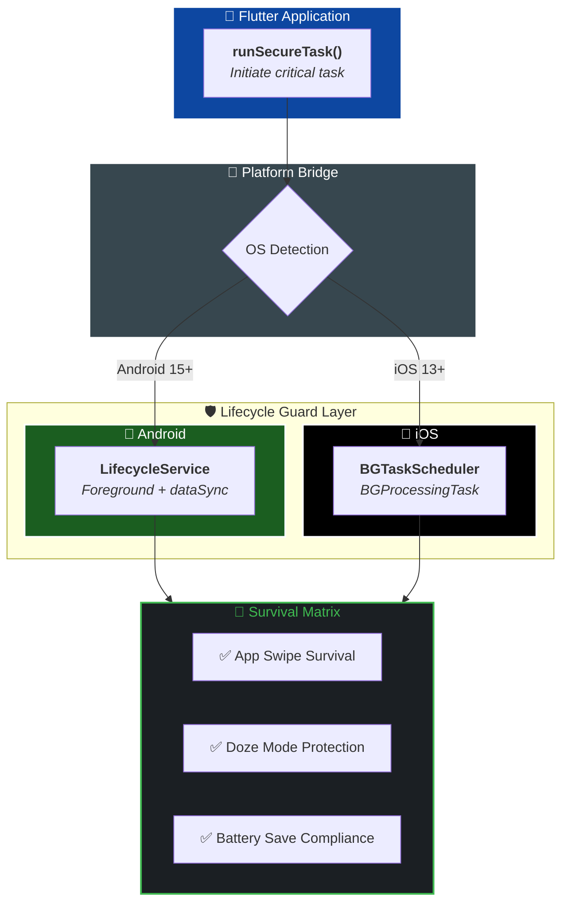

<div align="center">


# lifecycle_guard

**The bulletproof Flutter plugin for mission-critical background execution.**

Stop losing data when Android or iOS aggressively kills your app.
`lifecycle_guard` ensures your background tasks survive termination, system reboots, and battery optimizations — guaranteed.

[](https://github.com/Crealify/lifecycle_guard)
[](https://pub.dev/packages/lifecycle_guard)
[](https://github.com/Crealify/lifecycle_guard/blob/main/LICENSE)
[](https://flutter.dev)
[](#⚙️-platform-specific-setup-required)

</div>

---

## 🔴 The Problem
Ever noticed your background tasks suddenly stop when a user swipes your app away?
Modern mobile operating systems (Android 15+ and iOS 13+) are increasingly aggressive at killing processes to save battery.
*   **User Swipes App**: Your Dart Isolate is instantly killed.
*   **System Pressure**: The OS reclaims memory, terminating your "background" thread.
*   **Battery Optimization**: Tasks are deferred or canceled without warning.

If your app is syncing a database, uploading a large file, or processing a payment, **you just lost data.**

## 🛡️ The Solution: lifecycle_guard
`lifecycle_guard` creates a **Native Protection Layer** around your critical tasks. 
By bridging to native Foreground Services (Android) and Background Processing Tasks (iOS), it ensures your logic completes even if the UI process is wiped from memory.

---

## ✨ Key Benefits
- **✅ Survival-First**: Survives app swipes, low-memory kills, and doze modes.
- **✅ Android 15 Ready**: Built-in support for `foregroundServiceType: dataSync`.
- **✅ iOS BGTask Integration**: Properly utilizes Apple's `BGTaskScheduler`.
- **✅ Zero Config Isolation**: Automatically boots a secondary engine for your task.
- **✅ Developer Friendly**: 100% type-safe API with simple `payload` support.

## 🚀 When to Use
- **Data Syncing**: Sending offline records to your server.
- **File Processing**: Compressing or encrypting local files.
- **Media Uploads**: Ensuring a user's video actually finishes uploading.
- **State Updates**: Finalizing critical database transactions.

---

## 📦 Step-by-Step Installation

### 1. Add to dependencies
Add this to your `pubspec.yaml`:
```yaml
dependencies:
  lifecycle_guard: ^1.0.1
```

### 2. Platform Setup (REQUIRED)
You **must** configure the native layer for the guard to hold. 

#### 🤖 Android Configuration
Open `android/app/src/main/AndroidManifest.xml`:
1.  **Add Permissions** (outside `<application>`):
    ```xml
    <uses-permission android:name="android.permission.FOREGROUND_SERVICE" />
    <uses-permission android:name="android.permission.FOREGROUND_SERVICE_DATA_SYNC" />
    <uses-permission android:name="android.permission.POST_NOTIFICATIONS" />
    ```
2.  **Declare Service** (inside `<application>`):
    ```xml
    <service
        android:name="com.crealify.lifecycle_guard_android.LifecycleService"
        android:foregroundServiceType="dataSync"
        android:exported="false">
    </service>
    ```

#### 🍎 iOS Configuration
1.  **Xcode Capabilities**: Enable **Background Modes** and check `Background fetch` & `Background processing`.
2.  **Info.plist**: Register the task identifier:
    ```xml
    <key>BGTaskSchedulerPermittedIdentifiers</key>
    <array>
        <string>com.crealify.lifecycle_guard.background_task</string>
    </array>
    ```

---

## 💡 Full Copy-Paste Example
A complete `main.dart` showing a button that triggers a protected task.

```dart
import 'package:flutter/material.dart';
import 'package:lifecycle_guard/lifecycle_guard.dart';

void main() {
  // 1. Ensure Flutter bindings are ready
  WidgetsFlutterBinding.ensureInitialized();
  runApp(const MaterialApp(home: GuardExample()));
}

class GuardExample extends StatelessWidget {
  const GuardExample({super.key});

  // 2. This function triggers the protection
  Future<void> _triggerSecureTask() async {
    try {
      // 🛡️ The 'Guard' boots here. 
      // After this call, you can swipe the app away and the task will continue.
      await LifecycleGuard.runSecureTask(
        id: "sync_records_001",
        payload: {
          "user_id": "usr_99",
          "action": "sync_offline_db",
          "timestamp": DateTime.now().toIso8601String(),
        },
      );
      
      // The code below continues to run in a protected state
      debugPrint("Guard is active. You can now close the app.");
      
    } catch (e) {
      debugPrint("Failed to start guard: $e");
    }
  }

  @override
  Widget build(BuildContext context) {
    return Scaffold(
      appBar: AppBar(title: const Text('🛡️ lifecycle_guard Demo')),
      body: Center(
        child: Column(
          mainAxisAlignment: MainAxisAlignment.center,
          children: [
            const Icon(Icons.security, size: 80, color: Colors.blue),
            const SizedBox(height: 20),
            const Text(
              'Click the button, then swipe the app away\nfrom the multitasking view!',
              textAlign: TextAlign.center,
              style: TextStyle(fontSize: 14, color: Colors.grey),
            ),
            const SizedBox(height: 30),
            ElevatedButton(
              onPressed: _triggerSecureTask,
              style: ElevatedButton.styleFrom(
                padding: const EdgeInsets.symmetric(horizontal: 30, vertical: 15),
                shape: RoundedRectangleBorder(borderRadius: BorderRadius.circular(10)),
              ),
              child: const Text('Start Protected Background Task'),
            ),
          ],
        ),
      ),
    );
  }
}
```

---

## 🧠 How It Works



---

## 📄 License

BSD 3-Clause License — see [LICENSE](https://github.com/Crealify/lifecycle_guard/blob/main/LICENSE) for details.

---

<div align="center">

Built with ❤️ by [Crealify](https://anil-bhattarai.com.np) · Open to collaborate · PRs welcome

</div>
