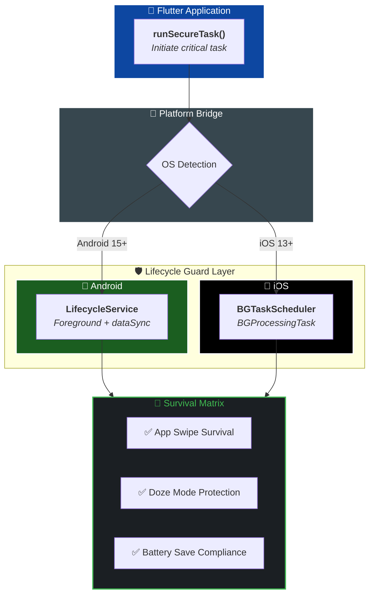

<div align="center">


# lifecycle_guard

**The bulletproof Flutter plugin for mission-critical background execution.**

Stop losing data when Android or iOS aggressively kills your app.
`lifecycle_guard` ensures your background tasks survive termination, system reboots, and battery optimizations — guaranteed.

[](https://github.com/Crealify/lifecycle_guard)
[](https://pub.dev/packages/lifecycle_guard)
[](https://github.com/Crealify/lifecycle_guard/blob/main/LICENSE)
[](https://flutter.dev)
[](#platform-support)
[](https://github.com/Crealify/lifecycle_guard/blob/main/CONTRIBUTING.md)

</div>

---

## 🎬 Demo

<div align="center">
  
  <p><i>Watch lifecycle_guard in action: App swipe → Background survival → Task completion.</i></p>
</div>

---

## ✨ Features

| Feature | Description |
|---|---|
| 🛡️ **Isolate Protection** | Boots a lightweight secondary engine so your task never shares the UI thread fate |
| 🤖 **Android 15+ Ready** | Fully compliant with new `foregroundServiceType: dataSync` requirements |
| 🍎 **iOS Compatible** | Bridges to Apple's native background task scheduler |
| 📡 **Zero Data Loss** | Tasks continue even when users swipe the app away |
| ⚡ **30-Second Setup** | One-line API — no complex native configuration needed |
| 🔐 **User-Safe** | No auto-execution, no hidden scripts, everything is user-triggered |

---

## 🚀 Quick Start

### Installation

Add to your `pubspec.yaml`:

```yaml
dependencies:
  lifecycle_guard: ^1.0.1
```

### ⚙️ Platform-Specific Setup

For production use, you **must** configure the native layer for each platform. Click below for detailed guides:

| Platform | Setup Guide | Key Requirements |
|---|---|---|
| **Android** | [Android Guide](https://pub.dev/packages/lifecycle_guard_android) | Manifest Service, Notification Permissions |
| **iOS** | [iOS Guide](https://pub.dev/packages/lifecycle_guard_ios) | Background Modes, Task Identifiers |
| **Common** | [Interface Docs](https://pub.dev/packages/lifecycle_guard_platform_interface) | Internal Contract Details |

---

## 💡 Usage

```dart
import 'package:lifecycle_guard/lifecycle_guard.dart';

// Trigger a mission-critical background task
await LifecycleGuard.runSecureTask(
  id: "sync_user_data",
  payload: {
    "userId": "12345",
    "retry": true,
    "timestamp": DateTime.now().toIso8601String(),
  },
);
```

---

## 🧠 How It Works



---

## 📄 License

BSD 3-Clause License — see [LICENSE](https://github.com/Crealify/lifecycle_guard/blob/main/LICENSE) for details.

---

<div align="center">

Built with ❤️ by [Crealify](https://anil-bhattarai.com.np) · Open to collaborate · PRs welcome

</div>

